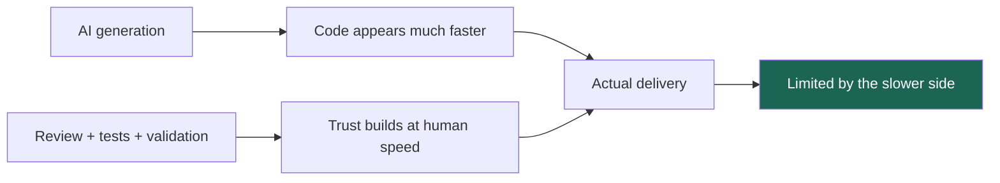
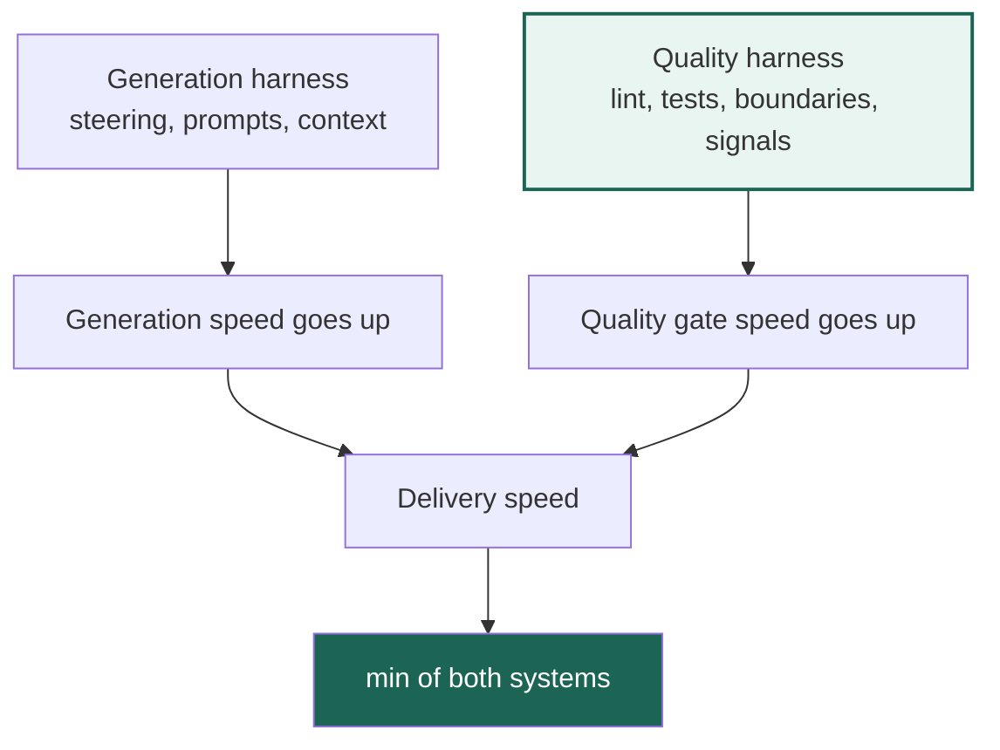

*This is a 2-part series on AI velocity and engineering quality. Part 1 covers why faster code generation does not automatically create faster delivery in enterprise teams. Part 2 covers the operating model: deterministic rules, steering loops, and confidence signals.*

# Velocity Without Drift — Part 1: The Dual Harness Problem

Since 2025, roughly 90% of the code my team ships has been AI-generated. That changed the pace of coding immediately. It did not change the pace of trust.

Ticket velocity looks healthier. Diffs appear faster. But delivery has not improved at the same rate, and the reason is simpler than most AI discussions make it sound:

**AI made code generation fast. It did not make validation fast.**

That sentence is the whole problem statement. In enterprise systems, delivery speed is not the speed of typing. It is the speed of the slowest stage that still needs to happen before the change is trusted enough to merge.

```text
Delivery speed = min(generation speed, quality gate speed)
```

Once I started looking at the system that way, a lot of confusing signals snapped into focus. We were celebrating faster generation while review rounds stayed stubbornly familiar. The code appeared sooner, but human confidence still accumulated at roughly the old pace.

## The Bottleneck Moved, Then Stopped

The most useful metric I have found here is not "lines of code generated" or even "tickets closed." It is how many revision loops still happen before a pull request feels safe to land.

Before widespread AI usage, a complex PR might take 3 to 5 rounds to get clean. After AI adoption, I still see 3 to 5 rounds on many changes that matter. The work shifted, but the bottleneck did not disappear.



That is why raw generation speed can create a misleading sense of progress. A faster model does not automatically reduce review load. In some cases it increases it, because the system now produces more plausible code that still needs to be checked carefully.

This is also why I think enterprise teams should talk less about AI as a writing tool and more about AI as a throughput multiplier. A throughput multiplier scales good output and bad output at the same time. If the validation layer does not get stronger, defect throughput rises with feature throughput.

## The Missing Half of the System

Most teams I talk to are already investing in what I would call the generation harness:

| Generation harness | What it improves |
|---|---|
| Steering files | Better default behavior |
| Context injection | Better task grounding |
| Task decomposition | Cleaner execution |
| Prompt patterns | Faster first pass |

That work matters. It makes agents easier to aim.

But there is a second harness that matters just as much in enterprise codebases, and it is still underbuilt in many teams: the quality harness.

| Quality harness | What it improves |
|---|---|
| Lint and build gates | Structural correctness |
| Tests mapped to user stories | Behavioral confidence |
| Domain boundary enforcement | Safer changes in legacy systems |
| Agent-readable errors | Faster self-correction |



The key idea is straightforward: you do not get faster delivery by optimizing only the left side. Once generation outruns validation, every extra gain on generation is mostly idle capacity. You have a larger factory upstream and the same checkpoint downstream.

## Why Enterprise Teams Feel This First

This gap is much sharper in enterprise systems than in personal projects or greenfield demos.

Legacy codebases carry hidden contracts. Compliance rules and operational boundaries are often real even when they are not written down cleanly. A generated change can look polished while still violating a five-year-old behavior that only exists in review comments, naming conventions, or one senior engineer's memory.

That is why "move fast and fix later" becomes expensive so quickly in this environment. The agent is not scared of hidden complexity. It will produce a confident-looking answer either way. If the system around it does not surface the right constraints, the error arrives later, when context is gone and blast radius is bigger.

The sentence I keep coming back to is this: **speed without confidence is not speed.**

If a team ships more code but also creates more rework, more review churn, and more post-merge debugging, it did not become faster. It just moved uncertainty to a more expensive part of the pipeline.

## What I Think Teams Should Optimize For

The goal is not to slow agents down. The goal is to make trust accumulate faster.

That changes the investment question. Instead of asking, "How do we get the model to write more code without interruption?" I think enterprise teams should ask:

- What defects are still discovered in review instead of before review?
- Which repeated comments should already be deterministic rules?
- Where are we relying on reviewer memory instead of system behavior?

The shift is subtle but important. The best AI teams will not just have stronger prompts. They will have stronger validation systems.

That is the real message of the dual harness model: generation and quality have to compound together. If one side accelerates and the other stays flat, delivery drifts. If both sides tighten at once, the team earns a new level of speed without lowering the bar.

For me, that is the practical frame: AI has made code cheaper. Trust is now the scarce resource.

---
*Part 2 of this series covers the operating model: how to turn repeated review comments into deterministic rules, where steering still matters, and which signals are strong enough to support lighter review. Coming next.*
