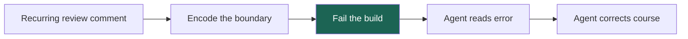
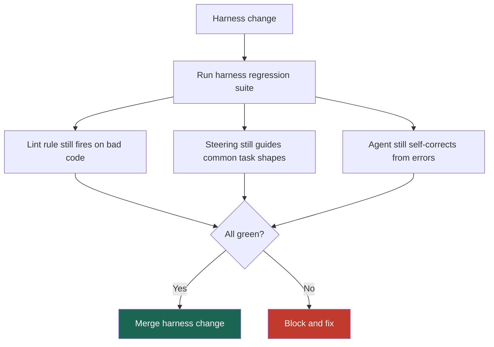

*Part 2 of 2. [Part 1](post.html?slug=2026-03-29-ai-velocity-part-1) explained the bottleneck: AI accelerated generation faster than enterprise teams accelerated validation. This part covers the operating model that closes that gap.*

# Velocity Without Drift — Part 2: Building the System

The idea is not complicated: if AI makes code cheap, then trust needs better infrastructure. In practice, that means I stop treating review comments as isolated fixes and start treating them as raw material for system design.

The rule I use is blunt: **if the same defect can appear twice in review, it deserves a rule.**

## Track A: Deterministic Enforcement

The highest-leverage work is moving repeated review feedback into build-time enforcement.

Some patterns still look like over-structure when judged through a human-only lens. In agent-heavy systems, those same patterns are often exactly what removes ambiguity:

| Pattern | Why humans resist it | Why agents benefit |
|---|---|---|
| Explicit domain boundaries | Feels verbose | Removes guesswork about where logic belongs |
| Strict import rules | Feels rigid | Prevents cross-layer drift mechanically |
| Standardized error types | Feels repetitive | Makes failure handling predictable |
| Story-mapped tests | Feels wordy | Preserves behavior across refactors |

The important move is not just adding rules. It is writing rules the agent can recover from.

An error like "forbidden import" helps a reviewer. An error like "UI layer cannot import `pricing-domain`; use `PricingViewModel` instead" helps the agent self-correct before a human gets involved. That turns the build into an active part of the training loop.

This is why I increasingly think of QA as the new compiler for probabilistic code. The quality harness takes plausible output and rejects everything that has not earned the right to move forward.

## Track B: Dynamic Steering

Not everything should become a lint rule.

Some decisions still need judgment: how to decompose a task, when to write a failing test first, what edge cases belong in scope, and what "done" means for a particular domain. That is where steering files and team SOPs matter.

The biggest benefit of good steering is not convenience. It is variance reduction.

Without a shared process, the same agent plus the same codebase can produce very different outcomes depending on who is driving. A stronger engineer gives tighter context, decomposes more cleanly, and gets a usable answer faster. A weaker engineer burns cycles in a long correction loop. That looks like an individual skill gap, but it is also a systems gap.

Shared steering narrows that spread. If every engineer starts from the same decomposition pattern, testing expectations, and scope rules, the floor rises for the whole team.

The pipeline I want is simple:

1. Put judgment-heavy guidance in steering first.
2. Watch for patterns that repeat.
3. Promote repeated patterns into deterministic enforcement.

Steering is not the final state. It is the staging area before codification.

## Test the Harness, Not Just the Code

Most teams test application behavior. Very few teams test the system that generates and validates the code.

That omission becomes expensive quickly. A lint rule stops firing after a dependency update. A steering change fixes one task shape and silently harms another. A model upgrade passes smoke tests but starts drifting on scope. If nobody is testing the harness itself, the team notices only after review rounds climb again.

That is why I want a harness regression suite alongside normal CI.

If the harness changes, the harness should prove it still works. Otherwise the team is editing the control plane without any instrumentation.

## Measure the Factory Like a Factory

I do not think teams need a huge measurement program to start. But they do need a few signals that describe whether trust is actually improving:

| Signal | What it tells me |
|---|---|
| CR revision rounds per PR | Whether review is still discovery-heavy |
| Agent iteration depth | Whether steering or task shape is weak |
| Token usage per task | Whether the agent is getting lost |
| Harness catch rate | Whether rules are alive and useful |
| Post-merge defects | Whether speed is being bought with hidden risk |

These signals are useful because they connect behavior to confidence. Passing tests and lint are table stakes. After that, the question becomes: does this change look like a bounded, understandable success, or like a lucky escape?

That is where I find confidence-gated routing useful. Green tests and clean lint get a PR to the starting line. The next layer of signals tells me how much human review the change still deserves. A bounded diff with clean first-pass lint and scoped test additions is a different object from a sprawling diff that required six correction loops.

The principle is simple: **autonomy is earned through signals, not assumed from speed.**

## Thresholds Are Local, Not Universal

One trap here is searching for a universal confidence score. I do not think that exists.

The right threshold depends on the blast radius of the service, the failure modes of the current model, and the historical defects in the codebase. A payment system and an internal admin tool can use the same signals and still need different review depth. A model change can also invalidate thresholds that used to feel safe.

So the work is not just defining a score. It is building a calibration loop:

- baseline the current model and service
- shadow-run changes before trusting them
- compare distributions, not anecdotes
- tighten or loosen thresholds only after you understand the drift

That is slower than declaring victory, but it is how teams expand autonomy without lying to themselves.

The long-term goal is still ambitious. I want review to move away from line-by-line inspection and toward artifacts, tests, and signals. But that future only works if the system has earned it, one verified step at a time.

That is what "velocity without drift" means to me in practice: a code generation system that gets faster while the trust system gets sharper, not thinner.
